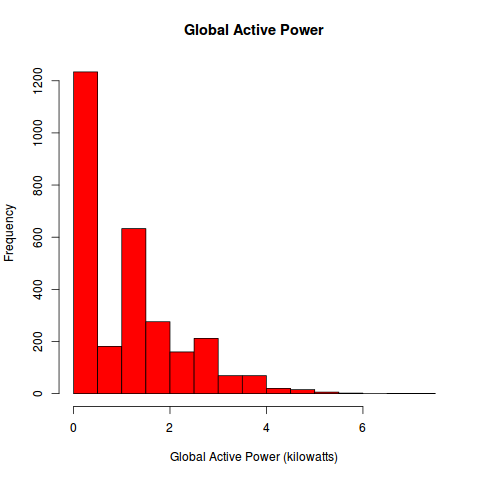
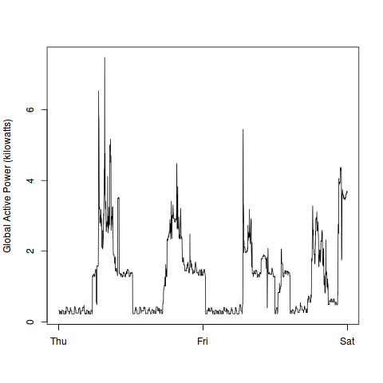
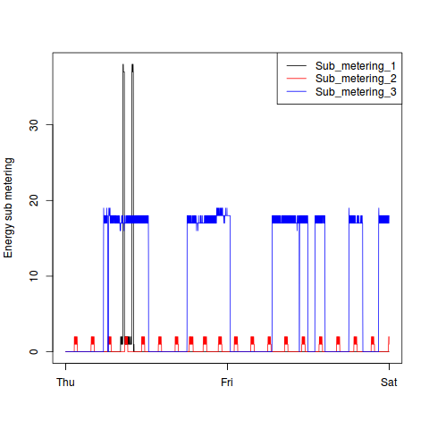
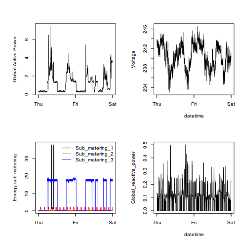

Contents
--------

* [CodeBook](CodeBook.md)
* [Plot 1](README.md#plot 1)
* [Plot 2](README.md#plot 2)
* [Plot 3](README.md#plot 3)
* [Plot 4](README.md#plot 4)

Plot 1
------

[source (plot1.R)](plot1.R)

Plot 2
------

[source (plot2.R)](plot2.R)

Plot 3
------

[source (plot3.R)](plot3.R)

Plot 4
------

[source (plot4.R)](plot4.R)
